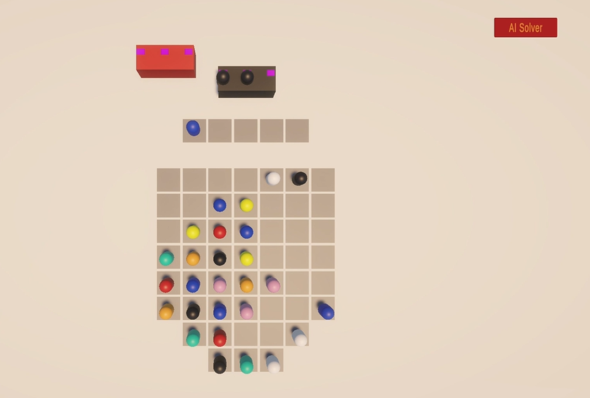

# Bus Jam AI Solver 🚌🤖

An autonomous AI agent developed for a custom **Unity 6** prototype of the popular puzzle game *Bus Jam*. This project demonstrates a hybrid approach between traditional search algorithms and heuristic-based strategic reasoning to solve complex resource management problems in real-time mobile environments.

## 🎮 Gameplay & UI Preview

| Autonomous Decision Engine in Action | Custom Inspector UI / Grid State |
|---|---|
|   | <video src="https://github.com/eceozcan/rollic-busjam-ai-solver/raw/main/AIBusJam.mp4" width="100%" controls></video> |

## 🚀 Key Results
* **Level Success:** Successfully solves **6 out of 7** levels fully autonomously.
* **Performance:** Highly optimized to run at **60 FPS** on the Unity Main Thread.
* **Engineering Evolution:** Iterative development from a reactive baseline (v1.0) to a predictive strategic agent (v4.0).

## 🧠 The Approach: Heuristic-based Probabilistic Backtracking
Instead of using resource-heavy brute-force search (like BFS/DFS), I developed a **Heuristic-based Simulation** model. This allows the AI to mimic high-level human strategic thinking while respecting mobile hardware constraints.

### Core Features:
* **Master Heuristic Scoring:** Evaluates every possible move based on **Unblock Value** (prioritizing tiles that hide critical colors) and **Predictive Matching** (accounting for the next 2 buses in the queue).
* **Probabilistic Look-ahead:** When slot capacity becomes critical ($\le2$), the agent simulates 8-12 moves ahead to calculate the "survival probability" of a path.
* **Dynamic Risk Thresholding:** A custom mechanism that increases risk tolerance when a stalemate is detected, allowing for "calculated aggression" to unblock the grid.

## 🛠 Tech Stack
* **Engine:** Unity 6
* **Language:** C#
* **Architecture:** State-driven Autonomous Agent (`AISolverState`)
* **Analytics:** Custom CSV Logging System for move efficiency and heuristic stability analysis.

## 📈 Engineering Insight (The "Level 7" Case)
A significant part of this project involved analyzing **Level 7**, which presents a massive difficulty spike. By documenting why both the agent and human players struggle with this level, I utilized the AI as a **QA Validation Tool** to identify level design bottlenecks and report "mathematical deadlocks."

---

## 🎮 How to Use
1. Open the project in **Unity 6**.
2. Locate the **"AI Solver"** button in the custom Inspector/Editor UI.
3. Click to activate the autonomous mode and watch the agent analyze the grid and solve levels in real-time.

---

**Author:** Ece Özcan  
**Focus:** AI Engineering & Game Development  
